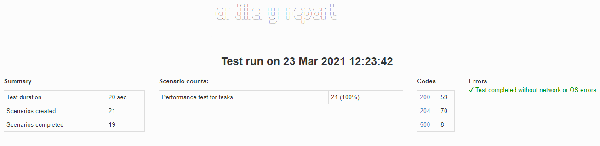

# Assesment 3 - Performance tests with Artillery.io
###QA Automation Certification

This repository contains my challenge exercises using artillery to get the QA Certification from Wizeline

## Installation

1. Clone this repository:

    ```sh
    git clone https://github.com/ruvaz/artillery-task-tests
    ```

2. Go to the project's root directory:

    ```sh
    cd artillery-task-tests
    ```

3. Install the dependencies:

    ```sh
    npm install 
    ```
4. Setup system environment var for TOKEN

   ### Windows
   
   ```
   set TOKEN=your_token_from_todois.com
   ```

   ###Shell
   
   ```sh
   export TOKEN=your_token_from_todois.com
   ```

## Usage

>It is mandatory to set the system environment variable for TOKEN before running any npm script.

**Production Test**

Use the `test_prd` script to run all the task tests in the staging environment. With the target pointed to `todoist.com`

```sh
npm run test_prd
```



**Staging tests**

Use the `test_qa` script to run all the task tests in the staging environment. With the target pointed to `localhost: 9080`

```sh
npm run test_qa
```


#Results

**Report generated**

You will find the report in the file `./results/report.html` 

**Log file generated**

You will find the log in the file: `./results/report.json` 
 

## Test in this Repository

Assessment session 3

The repository includes the following examples:

- Get active tasks 
- Create a new task
- Get an active task
- Update a task
- Change a task status to 'complete'
- Reopen a task
- Delete a task


## Bonus

**Faker**

Integration included with Faker.js to generate random data to create and update tasks. 
